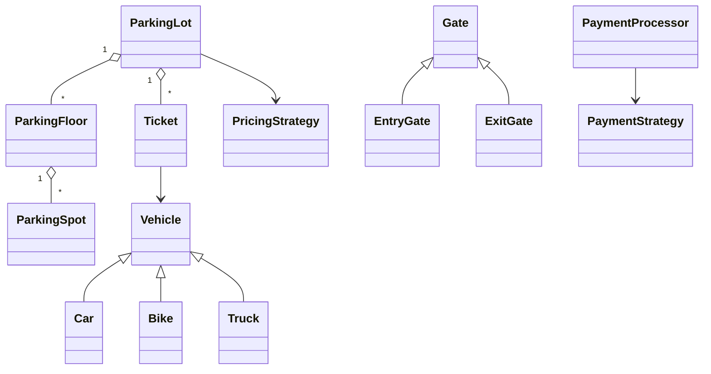

# Parking Lot LLD

TypeScript port of the Parking Lot implementation from:

- Video: https://www.youtube.com/watch?v=kzfrbkDcYjA
- Java source: https://github.com/shubhkpatel/Low-Level-Design/tree/main/src/main/java/org/nailyourinterview/lld/parking_lot

The code keeps the original design concepts while using idiomatic TypeScript module boundaries.

## Requirements represented

- Multiple parking floors
- Vehicle-specific parking spots
- Entry and exit gates
- Ticket generation
- Time-based and event-based pricing strategies
- Cash, UPI, and card payment strategies
- Vehicle/payment/pricing factories
- Singleton parking-lot service
- Safe check-and-set semantics for spot occupancy within one Node.js process

## Structure

```text
parking-lot/
├── enums/
│   └── index.ts
├── factories/
│   └── index.ts
├── models/
│   ├── gate.ts
│   ├── parking-floor.ts
│   ├── parking-spot.ts
│   ├── ticket.ts
│   └── vehicle.ts
├── services/
│   ├── parking-lot.ts
│   └── payment-processor.ts
├── strategies/
│   ├── payment.ts
│   └── pricing.ts
├── utils/
│   └── date-time-parser.ts
├── __tests__/
│   └── parking-lot.test.ts
├── example.ts
└── index.ts
```

## Core relationships



## Main flow

### Entry

```text
EntryGate
  -> ParkingLot.parkVehicle()
  -> ParkingFloor.findAvailableSpot()
  -> ParkingSpot.tryOccupy()
  -> Ticket
```

### Exit

```text
ExitGate
  -> ParkingLot.unparkVehicle()
  -> PricingStrategy.calculateFee()
  -> PaymentStrategyFactory
  -> PaymentProcessor.pay()
  -> ParkingSpot.vacate()
  -> remove active ticket
```

## Design patterns

### Singleton

`ParkingLot.getInstance()` mirrors the Java implementation.

### Factory

- `VehicleFactory`
- `PricingStrategyFactory`
- `PaymentStrategyFactory`

The caller asks for an abstraction and does not need to know the concrete constructor.

### Strategy

Pricing:

- `TimeBasedPricing`
- `EventBasedPricing`

Payments:

- `CashPayment`
- `UpiPayment`
- `CardPayment`

The algorithms can vary independently from the parking-lot orchestration.

## Concurrency: Java vs TypeScript

The Java source uses:

```java
occupied.compareAndSet(false, true)
```

That makes "check whether free + mark occupied" atomic across Java threads.

In normal Node.js, synchronous JavaScript on one event loop cannot be interrupted between:

```ts
if (this.occupied) return false;
this.occupied = true;
```

so `tryOccupy()` preserves the same domain-level check-and-set contract for this in-memory demo.

It is important not to overstate this guarantee: an in-memory boolean does **not** coordinate Node worker threads, clustered processes, containers, or multiple servers.

For a production distributed system, make the shared persistence layer authoritative, for example with an atomic conditional update or transaction:

```sql
UPDATE parking_spots
SET occupied = TRUE
WHERE id = $1
  AND occupied = FALSE;
```

Only the request that updates one row acquired the spot.

## Run

From the repository root:

```bash
pnpm install
pnpm parking-lot
```

## Test

```bash
pnpm test
```

## How this fits the repository

Each future LLD should live beside this one:

```text
src/
├── parking-lot/
├── rate-limiter/
├── elevator/
├── splitwise/
└── ...
```

Reuse the **repository convention**, not necessarily every Parking Lot folder.

For example, a Rate Limiter may naturally need:

```text
rate-limiter/
├── algorithms/
├── models/
├── services/
├── stores/
├── __tests__/
├── example.ts
├── index.ts
└── README.md
```

That keeps each problem cohesive without creating a giant shared abstraction layer for unrelated interview exercises.
